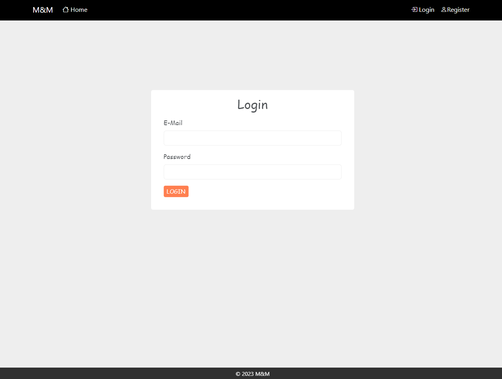
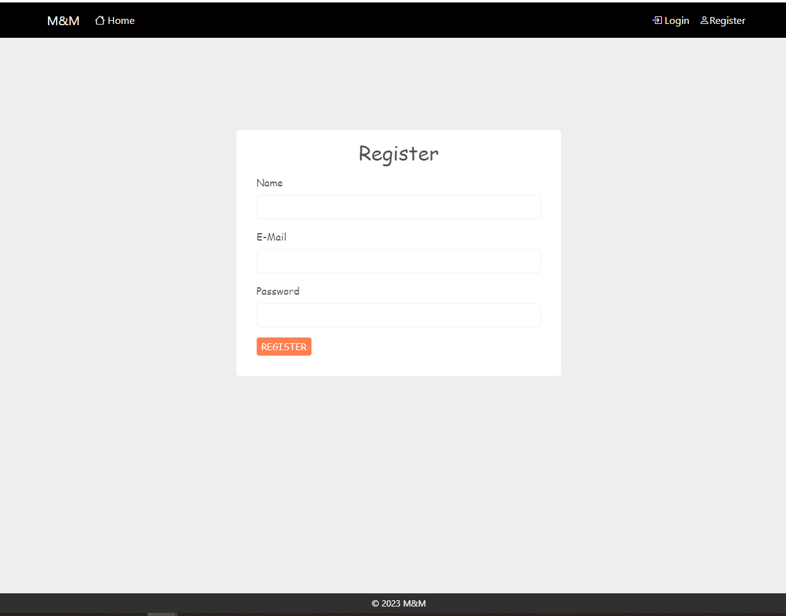
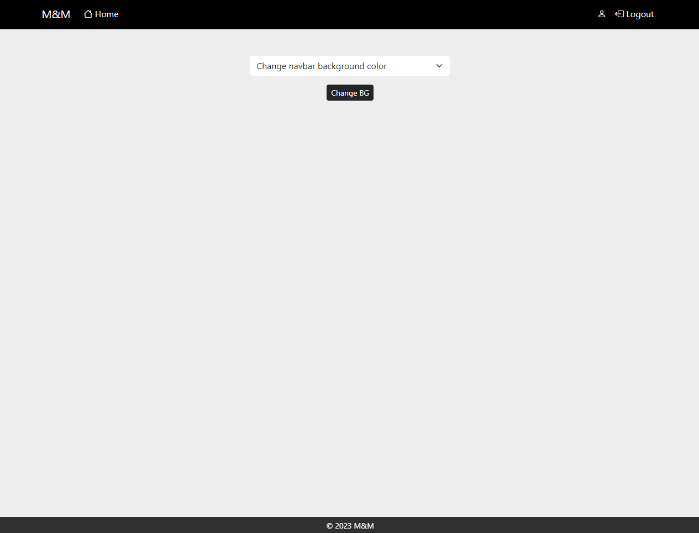
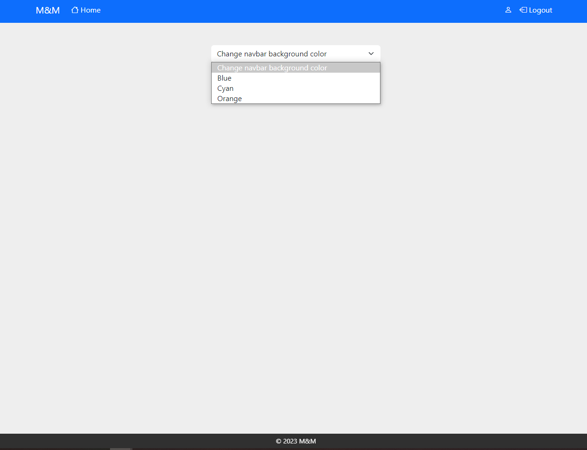

# Third week assignment

This week handles the sessions and cookies topic.

## UI & Tools

- Login form
- Register form
- Home page

- CSS
- Bootstrap
- JS
- JustValidate JS lib
- Form attributes validation

## Server

- Validate data
- Save user data into a local json file
- Authentication
- Store values in session or cookie

## Screenshots

