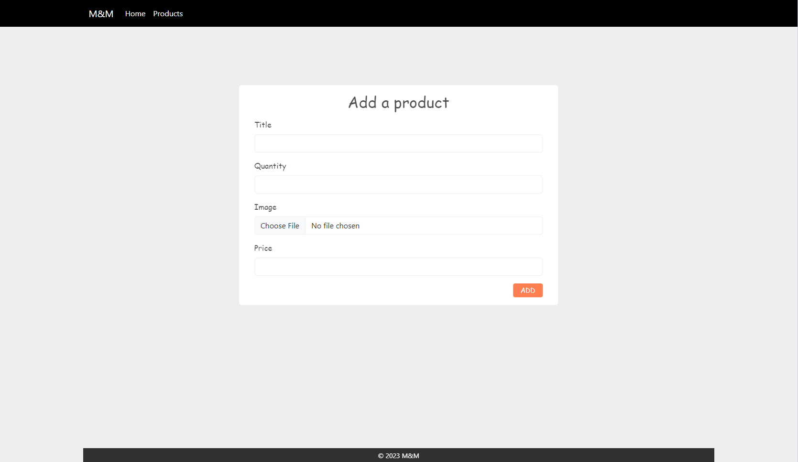
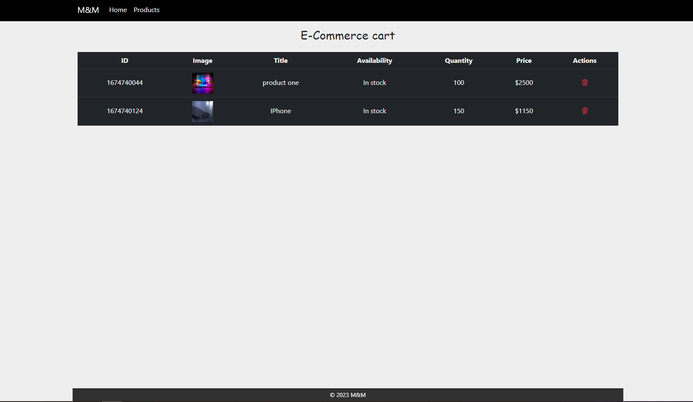
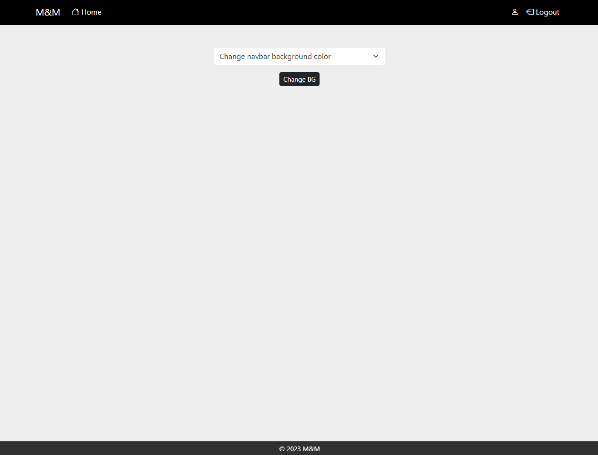
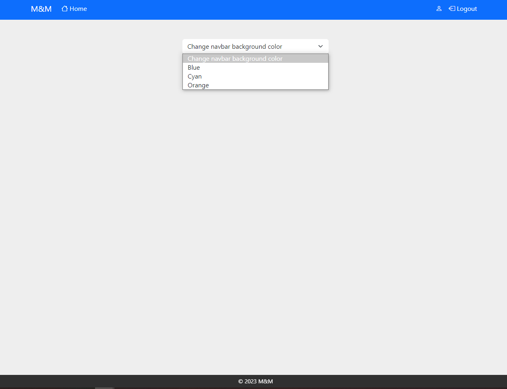

# Third week assignment

This week handles the sessions and cookies topic.

## Sessions directory

### UI & Tools

- Add a product form
- Products page

- CSS
- Bootstrap
- JS
- JustValidate JS lib

### Server

- Validate data
- Save product image in a local folder(uploads)

### Guideline

    1- Fill in the fields to add a new product.
    2- Visit the products page to check/manage all available products

### Screenshots

## Cookies directory

### UI & Tools

- Login form
- Register form
- Home page

- CSS
- Bootstrap
- JS
- Form attributes validation

### Server

- Validate data
- Save user data into a local json file
- Authentication
- Store values in session or cookie

### Guideline

    1- Create a new account
    2- Login
    3- Use the form on the main page to update the BG of navbar

### Screenshots

